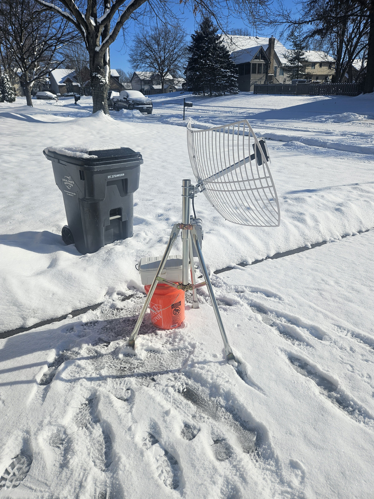
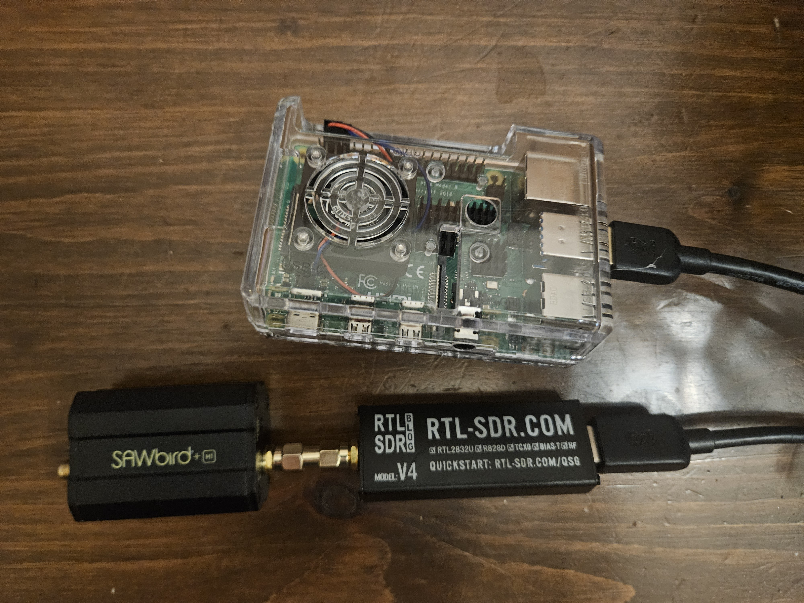
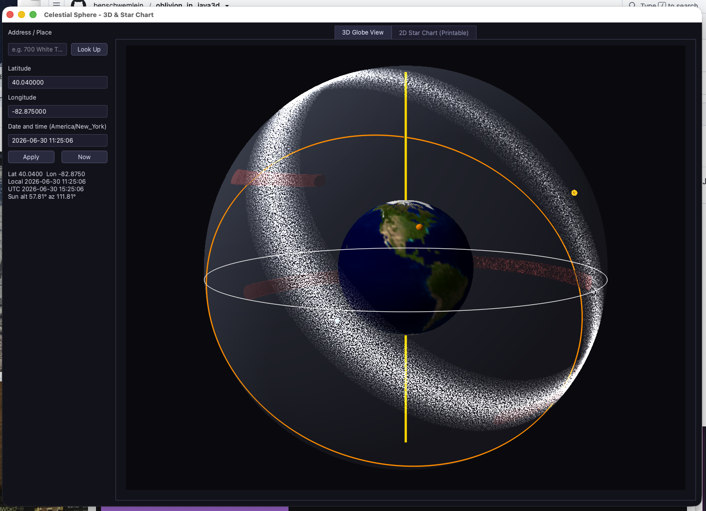
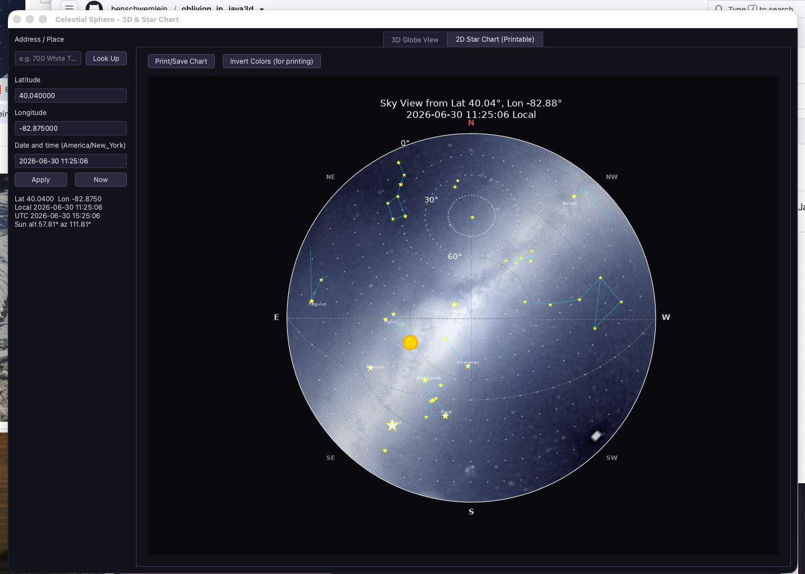
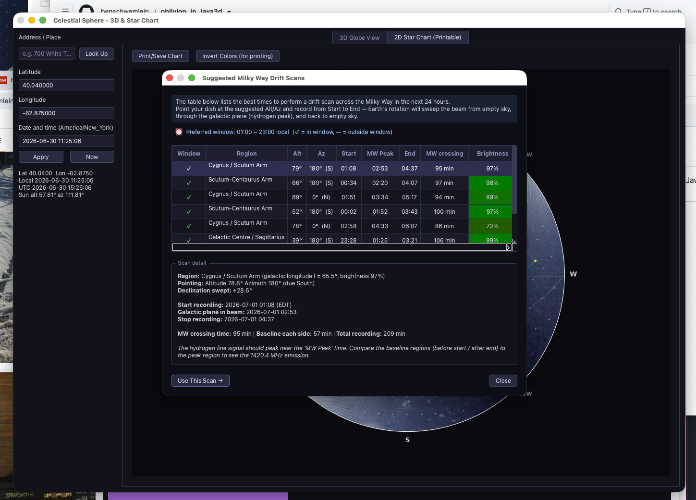

# Radio Telescope

A hobby radio telescope project using an RTL-SDR dongle and Raspberry Pi, with a PyQt6 app for planning and visualizing observations. The goal is to build a radio map of the Milky Way via hydrogen line (1420 MHz) observations, nothing new in radio astronomy, but fun to build from scratch.

The Milky Way is filled with vast clouds of neutral hydrogen gas that naturally emit radio waves. Hydrogen line observations are particularly useful because radio waves at 1420 MHz pass straight through interstellar dust clouds that block visible light. This means you can map parts of the Milky Way that are completely obscured in optical telescopes and see deeper into the galactic plane than any visible-light instrument allows. The hydrogen line frequency is also ideal because neutral hydrogen is the most abundant element in the galaxy, and its 21 cm emission is a known physical constant, so any Doppler shift in the received frequency directly reveals the radial velocity of that gas cloud. By measuring those shifts across different pointings you can map the rotation of the Milky Way itself.

The hydrogen signal is extremely faint, so a SAWbird+ H1 filter is used to amplify it and reject interference (see Hardware below).

## Hardware

| | |
|---|---|
|  |  |

```
NooElec Parabolic Dish + Feed
           │ RF
           ▼
SAWbird+ H1  (cavity filter + LNA, bias-tee powered)
           │ SMA
           ▼
RTL-SDR Blog V4  (USB SDR dongle, provides bias-tee power)
           │ USB
           ▼
Raspberry Pi  (runs rtl_power / rtl_power_fftw, saves CSV data)
           │ network
           ▼
PC  (runs this app for scan planning, pulls CSV files via scp)
```

The SAWbird+ H1 sits between the dish and the dongle and does two things: its cavity filter rejects interference outside the hydrogen line band, and its built-in low-noise amplifier boosts the faint incoming signal before it reaches the RTL-SDR. Without it the signal would be too weak to detect reliably.

See [SETUP.md](SETUP.md) for detailed hardware setup, `rtl_power` scanning commands, and Raspberry Pi configuration.

## App

Source: [`scripts/celestial_app/`](scripts/celestial_app/)

The app helps plan observations by showing a live 3D celestial sphere with your location, the Milky Way band, the Sun, and the horizon ring. You define a scan by setting altitude, azimuth, duration, and beam width. The dish stays fixed while the Earth rotates, so the beam drifts across a swath of sky over time. By combining many such swaths taken at different pointings, a radio map of the Milky Way is gradually built up. The planning app helps ensure full coverage: previously saved scans are shown on the globe alongside the Milky Way band, making it easy to spot unscanned gaps and plan new observations to fill them. A scan suggestion dialog recommends optimal observation windows based on when the Milky Way band is highest above the horizon at your location and time.

The app is still a work in progress. Planned additions:

- Bluetooth integration with a tilt meter on the dish to show the current pointing angle in real time
- User-friendly interface for controlling the scanning software on the Raspberry Pi
- Tools for managing and organizing collected scan data
- Ability to mark obstructions (trees, house, roofline) on the 2D map so they can be accounted for when planning scans
- Graph generation from collected scan data





## Requirements

- Python 3.11+
- RTL-SDR Blog V4 dongle (for actual observations)
- OpenGL-capable display

Install Python dependencies:

```bash
pip install -r requirements.txt
```

## Running

The app must be run from the `celestial_app` directory so that relative package imports resolve correctly:

```bash
cd scripts/celestial_app
python app.py
```
